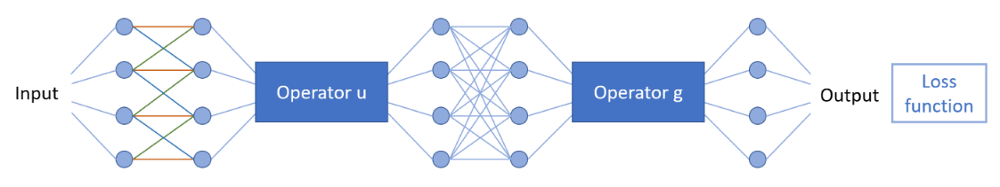
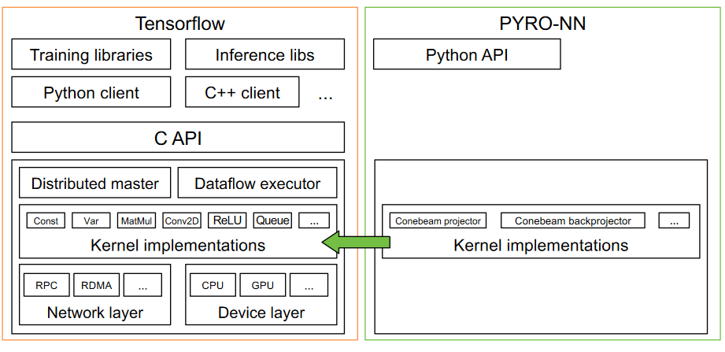

#  PyroNN v-1.1.0 documentation

[Download PowerPoint Presentation](assets/pyro-nn-overview.pdf)

We will demonstrate the capabilities of **Pyro-NN**, a differentiable reconstruction framework.

1. **📘 Introduction to Pyro-NN**: Gain a basic understanding of the theory behind Pyro-NN.
2. **⚙️ Installation and Setup**: Learn how to install and set up Pyro-NN on your machine.
3. **🔬 Working with Projection Data**: Explore how to work with projection data to initiate a reconstruction.
4. **🚀 Advanced Examples**: Discover more advanced examples showcasing the usage of Pyro-NN.

---

## 1. 📘 Introduction to Pyro-NN

### **1.1 Motivation** 💡

- We can make use of known operators

- For Deep Learning, the loss function and the amount of parameters to train can be reduced 🎯
- We can have gradient flow through different domains 🔄
- Parts of the neural network get interpretable, e.g. as filters 🧐

---

### **1.2 Basic Overview** 🌐

---

!!! tip "**General Notes** 📋"

        - 🤖 Supports TensorFlow and PyTorch
        - 💥 Full GPU Integration
        - 🔓 Open Source
        - 📜 Apache 2.0 License

